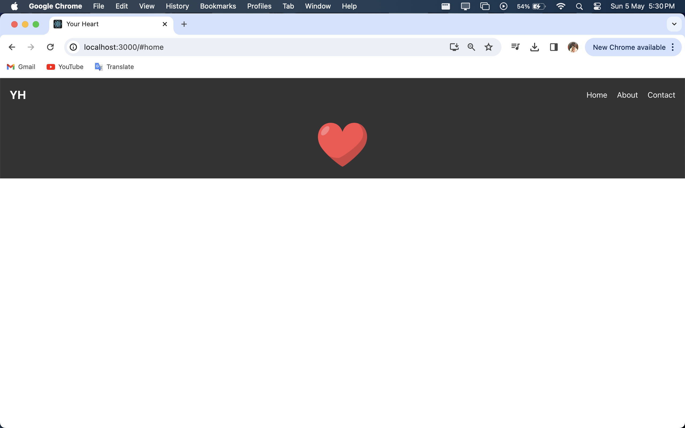
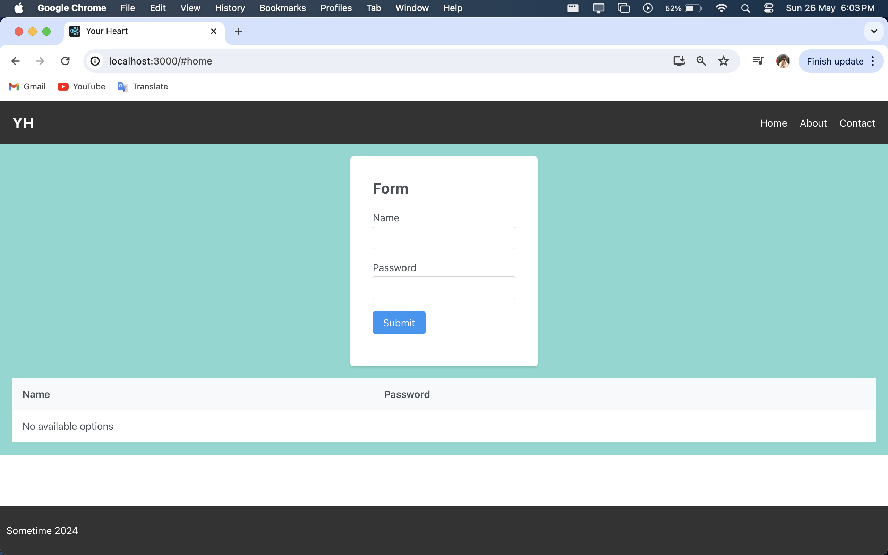
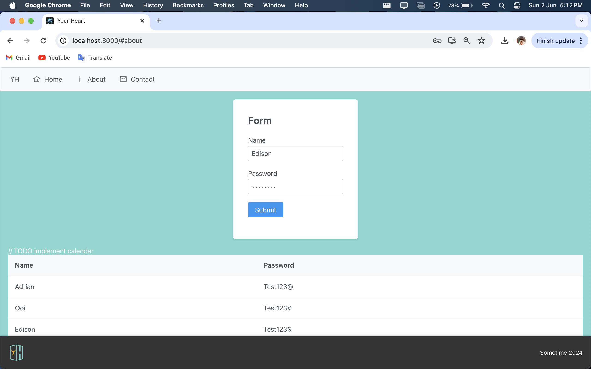

# Your Heart Project

This is a personal project about your heart. 

## Week 1 : Startup [5-5-2024]

## Week 2 : Carousel [12-5-2024]

## Week 3 : Text Animation [19-5-2024]

## Week 4 : Footer [26-5-2024]

## Week 5 : Logo [2-6-2024]

## Week 6 : Holiday [9-6-2024]

## Week 7 : Home Spacing [16-6-2024]

## Week 8 : [23-6-2024]

## Week 9 : [30-6-2024]

## Week 10 : [7-7-2024]

## Week 11 : [14-7-2024]

## Week 12 : [21-7-2024]

## Week 13 : [28-7-2024]

## Week 14 : [4-8-2024]

## Week 15 : [11-8-2024]

## Week 16 : [18-8-2024]

## Week 17 : [25-8-2024]

## Week 18 : Login Page [1-9-2024]

## Week 19 : Profile Page, Contact Page, About Page [8-9-2024]

## Week 20 : Holiday [15-9-2024]

### `npm start`

Runs the app in the development mode.\
Open [http://localhost:3000](http://localhost:3000) to view it in the browser.

The page will reload if you make edits.\
You will also see any lint errors in the console.

